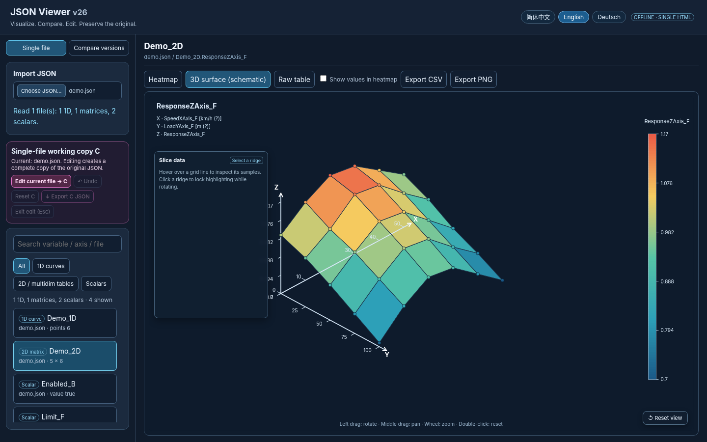
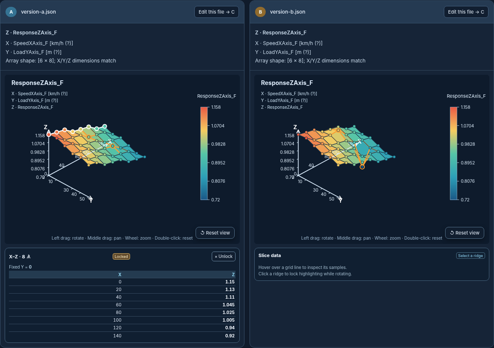
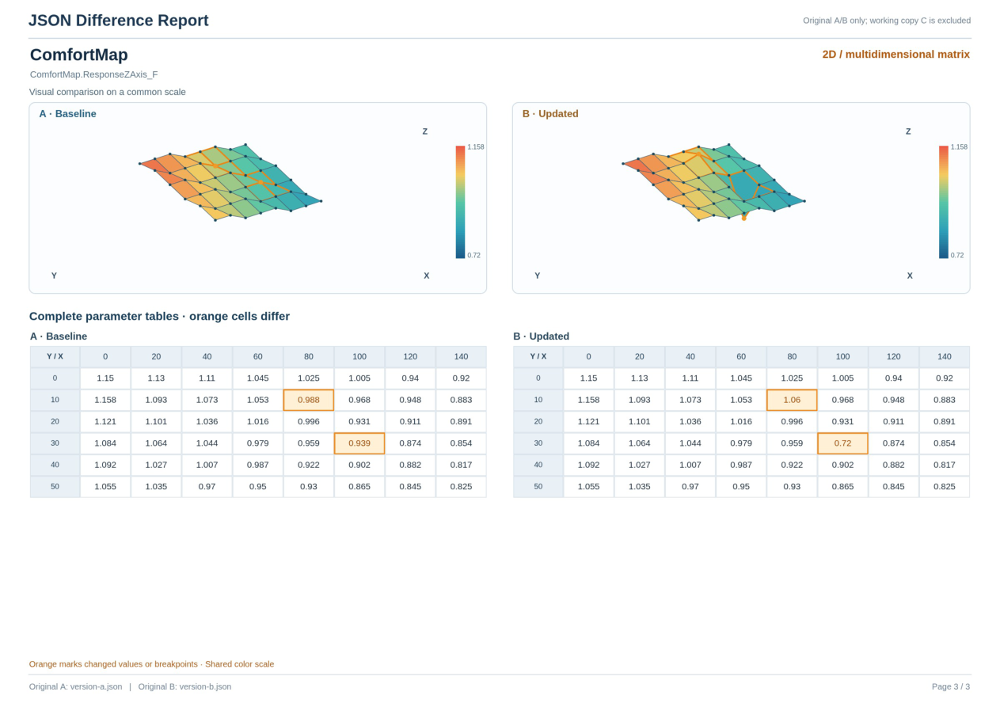

# JSON Viewer

**Visualize. Compare. Edit. Preserve the original.**

JSON Viewer is a lightweight, dependency-free, single-file web application for inspecting numerical arrays inside JSON files. Explore one-dimensional lookup curves, two-dimensional matrices, multidimensional array slices, and scalar parameters. Compare two revisions side by side, or edit a complete working copy without modifying the uploaded original.



**Languages:** [English](README.md) · [简体中文](README.zh-CN.md) · [Deutsch](README.de.md)

## Quick start

1. Download `index.html` and open it in a recent desktop browser (Chrome or Edge recommended).
2. Choose **Single file** to inspect a JSON document or **Compare versions** to load two related revisions.
3. Switch the interface language at the top right. Variable names, file paths, keys, and values in your JSON are not translated.

No installation, build process, account, or server is required. The application reads chosen files locally in your browser; it does not send your JSON to a backend.

## Features

- Detect numerical 1D arrays, explicit X/Y lookup curves, X/Y/Z matrices and numeric multidimensional arrays; inspect standalone scalar values.
- Plot 1D curves, heatmaps, and interactive 3D surfaces with coordinate axes, sample markers, and a Z-value color scale.
- In 3D: left-drag to rotate, middle-drag to pan, scroll to zoom, double-click to reset. Hover over points to inspect exact samples, hover over X–Z or Y–Z ridges to inspect a slice, and click to lock a slice. In single-file mode the slice inspector floats over the chart; in comparison mode it sits **below each 3D chart** to avoid obscuring either surface.
- Compare revision A with revision B using shared chart scales. Highlight changed, added, removed, and unchanged values.
- Create editable **working copy C** from one original (single-file mode) or from either A or B (comparison mode). The source document remains unchanged. See changes against the original; undo, reset, exit with confirmation, and export the full C JSON.
- Export CSV values and PNG plots. Export a separate CSV of scalar differences in comparison mode.
- **Export an offline, directly downloadable PDF difference report:** changed curves and matrices each occupy one page, with A/B visuals above and complete A/B parameter tables below. Changed samples and breakpoint headers are orange. Scalar differences are grouped several per page. PDF pages use a white background; multidimensional slices remain on a single, potentially taller page.
- Switch among Simplified Chinese, English, and German.

## Recognized JSON structure

For example, an explicit X/Y curve can be represented as:

```json
{
  "Curve": {
    "SpeedXAxis_F": [0, 10, 20],
    "ResponseYAxis_F": [1.0, 1.1, 0.9]
  }
}
```

A typical X/Y/Z map contains two breakpoint arrays and a matrix (rows corresponding to Y, columns to X):

```json
{
  "Map": {
    "SpeedXAxis_F": [0, 10, 20],
    "LoadYAxis_F": [0, 50],
    "ResponseZAxis_F": [[1.0, 1.1, 1.2], [0.9, 1.0, 1.1]]
  }
}
```

Try [`examples/demo.json`](examples/demo.json) for a self-contained sample, or load [`version-a.json`](examples/version-a.json) and [`version-b.json`](examples/version-b.json) to try version comparison and the PDF report. The viewer also includes heuristic pairing for same-length breakpoint/value arrays and generic numeric matrices. **Axis inference is not a schema guarantee:** review detected pairings before relying on them.





## PDF difference report

In **Compare versions**, load A and B and click **Export difference PDF** in the comparison toolbar. The browser downloads the report directly: no print dialog, server, or external library is needed. The report uses **original A/B**, even if you have an unexported working copy C. A curve or matrix has one dedicated report page with its visualization above complete parameter tables; scalar changes share pages. For arrays with more than two dimensions, all slices are listed on the same variable page, which may be taller than A4 landscape. The PDF contains high-resolution raster pages (not searchable/selectable text).

## Safe editing model

- Uploaded JSON is held in memory as an original source. Editing first creates a complete deep copy C.
- Each saved edit modifies C only; unrelated JSON fields stay in the exported copy.
- In comparison mode, you explicitly select whether C is based on A or B. Switching the source requires confirmation.
- Visual differences show original and edited data; the original uploaded file is never overwritten.
- Download the complete C JSON to keep your edits. There is no automatic save-back to your local file.

## Limits and data integrity

- X/Y/Z naming, dimensions, and matching are inferred from numerical structures. Not every possible JSON schema can be visualized automatically.
- Physical units may be **guessed from field names** and marked `(?)` when unverified. Check the source specification before using them.
- 3D surfaces connect original sampled values **for visual inspection only**; they do not implement an application's actual interpolation algorithm.
- This tool does **not** validate breakpoint monotonicity, required `_size_` consistency, domain constraints, or application-specific safety limits. Review the exported JSON before use.
- A browser's standard file picker normally hides absolute parent paths; if two files have the same name, you can supply short folder labels for display.
- Very large arrays may need additional performance optimization.

## Publish on GitHub Pages

The entire app is in `index.html`, with no external runtime dependencies. Push the contents of this folder to a repository; GitHub Pages can serve `index.html` directly from the selected branch/folder. You may also open it locally without Pages.

## Terminology / translation

| Concept | 简体中文 | English | Deutsch |
| --- | --- | --- | --- |
| Working copy | 工作副本 C | Working copy C | Arbeitskopie C |
| Breakpoint | 断点 | Breakpoint | Stützstelle |
| Ridge | 脊线 | Ridge | Profillinie |
| Slice | 切片 | Slice | Schnitt |
| Original value | 原值 | Original value | Originalwert |
| Current value | 现值 | Current value | Aktueller Wert |

Contributions and bug reports are welcome. For a reproducible issue, please use sanitized or synthetic JSON; do not publish confidential configuration files.

## License

**To be decided by the repository owner.** Add a `LICENSE` file (for example, MIT or Apache-2.0 if suitable) before announcing this project as open source. No license is assumed by this release package.
